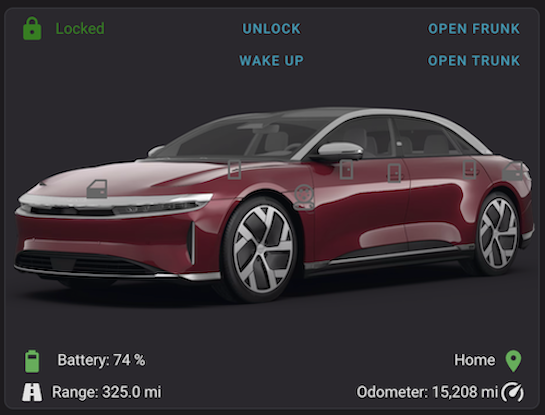
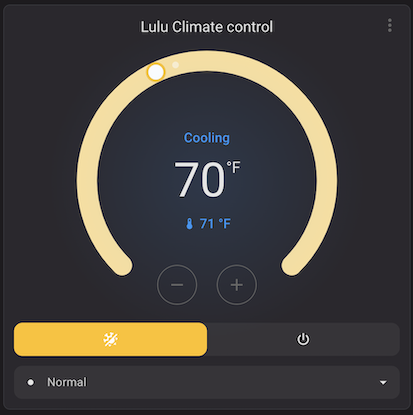
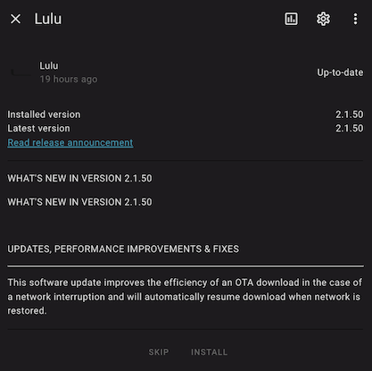
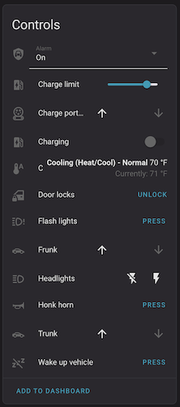
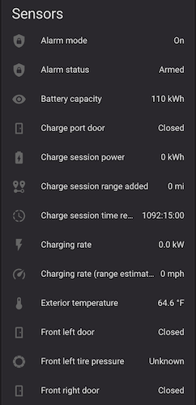
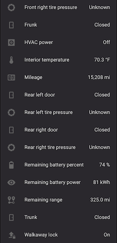

# (Unofficial) Lucid Motors integration for Home Assistant (HACS)

[![GitHub Release][releases-shield]][releases]
![Downloads][pypi-downloads-shield]

[![GitHub Activity][commits-shield]][commits]
[![License][license-shield]](LICENSE)
![Project Maintenance][maintenance-shield]

[![Community Forum][forum-shield]][forum]

_Integration for Home Assistant that uses [python-lucidmotors][python-lucidmotors]._

To use this extension, you'll need the following information

- Lucid Motors Username
- Lucid Motors Password

Your vehicle must be in delivered status for this integration to function.

## Installation
There are two methods to install this installation:

### HACS Installation (easiest)
1. Use [HACS](https://hacs.xyz/docs/setup/download).
1. In HACS, add a custom repository by going to `HACS > Integrations > 3 dots > custom repositories` and adding this github repo `https://github.com/borski/ha-lucidmotors`, with the `integration` type.
1. Restart Home Assistant
1. In the HA UI go to "Configuration" -> "Integrations" click "+" and search for "Lucid Motors"
1. Click  or in the Home Assistant UI go to "Configuration" -> "Integrations" click "+" and search for "Lucid Motors".

### Manual Installation
1. Using the tool of choice open the directory (folder) for your Home Assistant configuration (where you find `configuration.yaml`).
1. If you do not have a `custom_components` directory (folder) there, you need to create it.
1. In the `custom_components` directory (folder) create a new folder called `lucidmotors`.
1. Download _all_ the files from the `custom_components/lucidmotors/` directory (folder) in this repository.
1. Place the files you downloaded in the new directory (folder) you created.
1. Restart Home Assistant
1. Click  or in the Home Assistant UI go to "Configuration" -> "Integrations" click "+" and search for "Lucid Motors".

## Configuration is done in the UI

## Platforms / Sensors
**This integration will set up the following platforms.**

Platform | Description
-- | --
`binary_sensor` | Tons of info from the car.
`climate` | Precondition interior climate
`sensor` | Yet more info from the car.
`button` | Various actions like honk horn, flash lights, etc.
`device_tracker` | Where's your car? :)
`light` | Turn headlights on and off (and actually, *really* off)
`lock` | Doors
`cover` | Frunk, Trunk
`number` | Set charge limit
`select` | Alarm mode (on, off, silent/push notifications only)
`switch` | Start/stop charging
`update` | Update notifications, release notes, and remote installation

## Screenshots

# Disclaimer

This [Home Assistant](https://www.home-assistant.io/) integration is not affiliated, associated, nor sponsored by Lucid Motors, Inc.

Any use of this integration is at the sole discretion and risk of the Lucid Motors vehicle owner integrating it into their Home Assistant installation. This owner takes full responsibility for protecting their local Home Assistant installation.

This integration is provided out of love and passion towards the Lucid ownership community. It focuses on building insights and awareness into the state of one's vehicle for use by the owner and the owner alone.

This integration will not share user or vehicle data outside Home Assistant, a single-user environment hosted and running within an owner's private network and hardware systems.

## Contributions are welcome!

If you want to contribute to this please read the [Contribution guidelines](CONTRIBUTING.md)

***

[python-lucidmotors]: https://github.com/nshp/python-lucidmotors
[commits-shield]: https://img.shields.io/github/commit-activity/y/borski/ha-lucidmotors.svg?style=for-the-badge
[commits]: https://github.com/borski/ha-lucidmotors/commits/main
[forum-shield]: https://img.shields.io/badge/community-forum-brightgreen.svg?style=for-the-badge
[forum]: https://community.home-assistant.io/
[license-shield]: https://img.shields.io/github/license/borski/ha-lucidmotors.svg?style=for-the-badge
[maintenance-shield]: https://img.shields.io/badge/maintainers-Michael%20Borohovski%20%40borski,%20Nick%20Shipp%20%40nshp-blue.svg?style=for-the-badge
[releases-shield]: https://img.shields.io/github/release/borski/ha-lucidmotors.svg?style=for-the-badge
[releases]: https://github.com/ludeeus/integration_blueprint/releases
[pypi-downloads-shield]: https://img.shields.io/pypi/dm/lucidmotors?style=for-the-badge&logo=home-assistant
